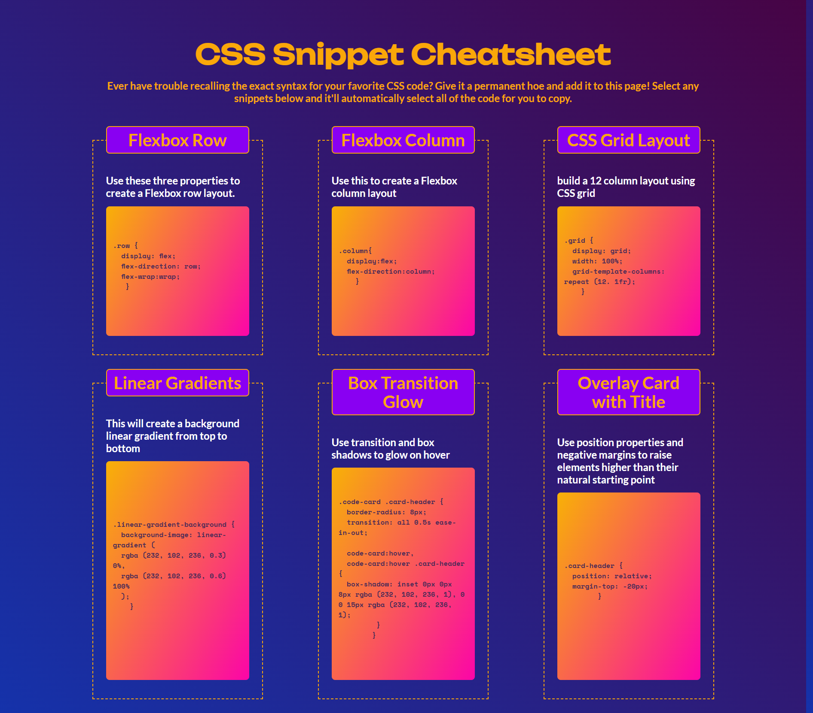

# css_snippet_guide
CSS Snippet Cheatsheet

Live Page: [Click here for link](https://cyphernyx.github.io/css_snippet_guide/)

## Instructions
The completed application should meet the following criteria:

-As a user, I can view a collection of labeled CSS snippets in a responsive grid.
-As a user, I can easily identify these CSS snippets by their headings.
-As a user, I can highlight a code snippet by clicking on it.
-As a user, I can view my application on a mobile device as well as a desktop.

## Specifications
Used semantic HTML elements and proper indentation.

Used CSS variables to maintain clean and reusable values for a color scheme.

Used flexbox and media queries to create a responsive grid layout.

Each CSS snippet has a card-like layout with the CSS syntax wrapped in an HTML pre element.

Each CSS snippet can easily be highlighted for copying on click using the CSS user-select property.

Incorporate a background color using a CSS linear-gradient function.

Incorporate a bit of animation using the CSS transition property.

## Screenshot

